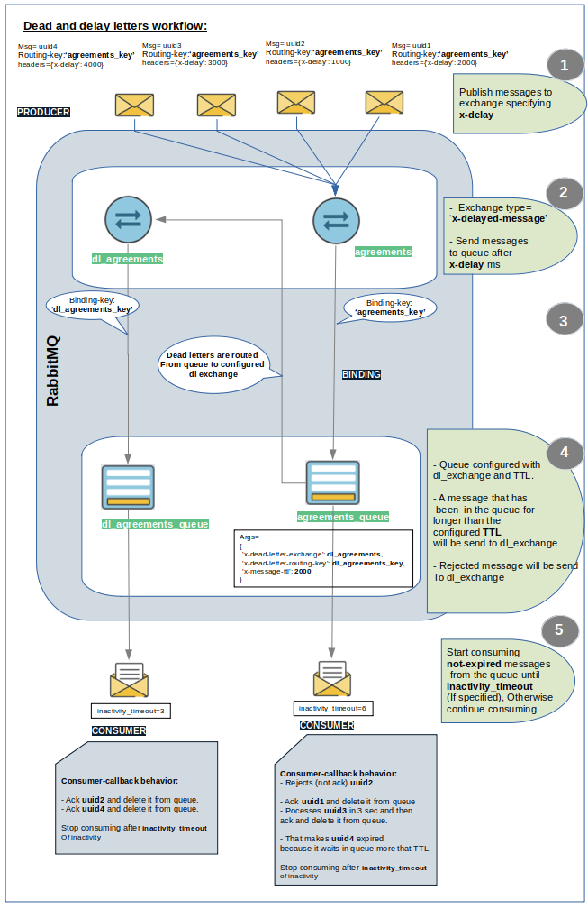

# FULL GUIDE

## Table of Content
- [Introduction](#introduction)
    * [The What](#theWhat)
    * [The Why](#theWhy)
    * [The How](#theHow)
- [Installation](#installation)
- [Start RabbitMQ](#startRabbitMQ)
- [RabbitMQ Message Concepts](#concepts)
- [RabbitMQ Message Cycle](#cycle)
- [Connect To RabbitMQ Server](#connectToServer)
- [Declare Exchange](#declareExchange)
- [Declare Queue](#declareQueue)
- [Bind Queue To Exchange](#bindQueueToExchange)
- [Publish Message](#publishMessage)
- [Start Consumer](#startConsumer)
- [Exchange Types](#exchangeTypes)
    * [Direct Exchange](#directExchange)
    * [Topic Exchange](#topicExchange)
    * [Fanout Exchange](#fanoutExchange)
    * [Headers Exchange](#headersExchange)
    * [Delay Exchange](#delayExchange)
- [Setup Queue With Dead Letters Exchange](#queueWithDeadLetters)
- [Dead and Delay Letters Workflow](#deadAndDelayLetters)
- [Resources](#resources)
---  
<div id='introduction'/>

## Introduction

<div id='theWhat'/>

### The What
> MRSAL Is a _message broker_ based on [**RabbitMQ**](https://www.rabbitmq.com/) with [**Pika**](https://pika.readthedocs.io/en/stable/#).

<div id='theWhy'/>

### The Why
> A message broker is software that enables applications, systems, and services to communicate with each other and exchange information. This allows interdependent services to "talk" with one another directly, even if they were written in different languages or implemented on different platforms.

<div id='theHow'/>

### The How
> The message broker does this by translating messages between these different services.

---
<div id='installation'/>

## Installation

MRSAL is available for download via PyPI and may be installed using pip.
```bash
pip install mrsal
```
---
<div id='startRabbitMQ'/>

## Start RabbitMQ Container

We are using **docker** to start a `RabbitMQ container` listening on the port `"5673"` with `"Delayed Message Plugin"` installed and enabled.

- Dockerfile
```Dockerfile
FROM rabbitmq:3.9.21-management

RUN apt-get update && \
    apt-get install -y curl unzip

# Add RabbitMQ Delayed Message Plugin
# Resource: Check limitaions https://github.com/rabbitmq/rabbitmq-delayed-message-exchange
RUN curl -L https://github.com/rabbitmq/rabbitmq-delayed-message-exchange/releases/download/3.9.0/rabbitmq_delayed_message_exchange-3.9.0.ez > $RABBITMQ_HOME/plugins/rabbitmq_delayed_message_exchange-3.9.0.ez && \
    chown rabbitmq:rabbitmq $RABBITMQ_HOME/plugins/rabbitmq_delayed_message_exchange-3.9.0.ez

# Enable plugin
RUN rabbitmq-plugins enable rabbitmq_delayed_message_exchange

# You can disable this plugin by calling 
# rabbitmq-plugins disable rabbitmq_delayed_message_exchange 
# PS!! ALL DELAYED MESSAGES THAT HAVEN'T BEEN DELIVERED WILL BE LOST.
```

- docker-compose.yml
```Dockerfile
version: "3.8"

services:
  rabbitmq_server:
    image: mrsal
    build:
      context: .
    container_name: mrsal
    environment:
      - RABBITMQ_DEFAULT_USER=${RABBITMQ_DEFAULT_USER}
      - RABBITMQ_DEFAULT_PASS=${RABBITMQ_DEFAULT_PASS}
      - RABBITMQ_DEFAULT_VHOST=${RABBITMQ_DEFAULT_VHOST}
    ports:
      # RabbitMQ container listening on port 5672.
      # Expose default port to the port 5673
      - "5673:5672"
      # OPTIONAL: Expose the GUI port
      - "15673:15672"
```

- Install image and start RabbitMQ container
```bash
docker-compose -f docker-compose.yml up
```

---
<div id='concepts'/>

## RabbitMQ Message Concepts

- **Producer** Is a user application that sends messages. Messages are not published directly to a queue; instead, the producer sends messages to an exchange. 
- **Exchange** Is responsible for routing the messages to different queues using header attributes, bindings, and routing keys. 
- **Binding** A binding is a connection that you build between a queue and an exchange.
- **Routing Key** Is a message attribute taken into account by the exchange when deciding how to route a message.
- **Queue** Is a buffer that receives and stores messages until the consumer receives them.
- **Consumer** Is a user application that receives and handles messages.
---
<div id='cycle'/>

## RabbitMQ Message Cycle

<p align="center">

</p>

1. The **producer** publishes a message to an exchange.

2. The **exchange** routes the message into the queues bound to it depending on exchange type and routing key.

3. The messages stay in the **queue** until they are handled by a consumer.

4. The **consumer** handles the message.
---
<div id='connectToServer'/>

## Connect To RabbitMQ Server

This tutorial assumes RabbitMQ is installed and running on localhost on the port (5673). In case you use a different host, vhost, port or credentials, connections settings would require adjusting.

- vhost: 
    - Think of vhosts as individual, uniquely named containers.
    - Inside each vhost container is a logical group of exchanges, connections, queues, bindings, user permissions, and other system resources. 
    - Different users can have different permissions to different vhost and queues and exchanges can be created, so they only exist in one vhost. 
    - When a client establishes a connection to the RabbitMQ server, it specifies the vhost within which it will operate
```py
mrsal = Mrsal(host='localhost',
            port=5673,
            credentials=('root', 'password'),
            virtual_host='v_host')

mrsal.connect_to_server()
```
---
<div id='declareExchange'/>

## Declare Exchange:

**Exchange** Is responsible for routing the messages to different queues using header attributes, bindings, and routing keys. 
- `exchange`: The exchange name 
- `exchange_type`: The exchange type to use
    - `direct`
    - `topic`
    - `fanout`
    - `headers`
    - `x-delayed-message`
- `passive`: Perform a declare or just check to see if it exists
- `durable`: Survive a reboot of RabbitMQ
- `auto_delete`: Remove when no more queues are bound to it
- `internal`: Can only be published to by other exchanges
- `arguments`: Custom key/value pair arguments for the exchange. E.g:
    - When the type of exchange is `x-delayed-message`, we specify how the messages will be routed after the delay period ([see example](#delayExchange)).
        ```py
        {'x-delayed-type': 'direct'}
        ```
```py
# Argument with the kye _x-delayed-type_ to specify how the messages will be routed after the delay period specified
EXCHANGE_ARGS: str = {'x-delayed-type': 'direct'}

mrsal.setup_exchange(exchange='agreements',
                    exchange_type='x-delayed-message',
                    arguments=EXCHANGE_ARGS,
                    durable=True, passive=False, internal=False, auto_delete=False)
```
---
<div id='declareQueue'/>

## Declare Queue:

**Queue** Is a buffer that receives and stores messages until the consumer receives them.
- `queue`: The queue name; if empty string, the broker will
    create a unique queue name
- `passive`: Only check to see if the queue exists and raise
    _ChannelClosed_ if it doesn't
- `durable`: Survive reboots of the broker
- `exclusive`: Only allow access by the current connection
- `auto_delete`: Delete after consumer cancels or disconnects
- `arguments`: Custom key/value arguments for the queue. E.g:
    - Specify dl exchange and dl routing key for queue
    - Specify an amount of time in ms expressing the time to live for the message in queue before it considered as **dead**. 
    - ([see example](#queueWithDeadLetters))
        ```py
        {'x-dead-letter-exchange': DL_EXCHANGE, 
        'x-dead-letter-routing-key': DL_ROUTING_KEY,
        'x-message-ttl': 2000}
        ```

```py
# Specify dl exchange and dl routing key for queue
QUEUE_ARGS = {'x-dead-letter-exchange': DL_EXCHANGE,
                'x-dead-letter-routing-key': DL_ROUTING_KEY,
                'x-message-ttl': 2000}
mrsal.setup_queue(queue='agreements_queue',
                arguments=QUEUE_ARGS,
                durable: bool = True,
                exclusive: bool = False, auto_delete: bool = False, passive: bool = False)
```
---
<div id='bindQueueToExchange'/>

## Bind Queue To Exchange:

Bind the queue to exchange.

- `queue`: The queue to bind to the exchange
- `exchange`: The source exchange to bind to
- `routing_key`: The routing key to bind on
- `arguments`: Custom key/value pair arguments for the binding. E.g:
    - When exchange's type is `headers`, we need to bound queue to exchange specifying the headers which has to match the published-messages' headers ([see example](#headersExchange)). 

```py
ARGS = {'x-match': 'all', 'format': 'zip', 'type': 'report'}
mrsal.setup_queue_binding(exchange='agreements',
                        routing_key='agreements_key',
                        queue='agreements_queue',
                        arguments=ARGS)
```
---
<div id='publishMessage'/>

## Publish Message

Publish message to the exchange specifying routing key and properties

- `exchange`: The exchange to publish to
- `routing_key`: The routing key to bind on
- `body`: The message body; empty string if no body
- `properties`: message properties. Eg:
    - `content_type`
    - `content_encoding`
    - `delivery_mode`
    - `headers`: Is useful when we want to send message with headers. E.g:
        - When exchange's type is `x-delayed-message` then we need to send messages to the exchange with `x-delay` header to specify delay time for message in exchange before route it to bound queue ([see example](#delayExchange)).
        - When exchange's type is `headers`, then we need to send messages with headers which match the binding-key of bound queues to the exchange ([see example](#headersExchange)).
```py
message: str = 'uuid'

# publish messages with  header x-delay expressing in milliseconds a delay time for the message.
headers={'x-delay': 2000}, 
properties = {
        'content_type'='text/plain',
        'content_encoding'='utf-8',
        'headers'=headers,
        'delivery_mode'=pika.DeliveryMode.Persistent
        }

mrsal.publish_message(fast_setup=False,
                exchange='agreements',
                routing_key='agreements_key',
                message=json.dumps(message),
                **properties
                )
```                        
--- 
<div id='startConsumer'/>

## Start Consumer

- Setup consumer:
    - Consumer start consuming the messages from the queue.
    - If `inactivity_timeout` is given the consumer will be canceled when inactivity_timeout is exceeded.
    - Send the consumed message to callback method to be processed, and then the message can be either:
        - Processed, then **correctly-acknowledge** and deleted from queue or 
        - Failed to process, **negatively-acknowledged** and then will be either
            - `Requeued` if requeue is True
            - `Dead letter` and deleted from queue if 
                - requeue is False
                - requeue is True and requeue attempt fails.

```py
def consumer_callback(host: str, queue: str, message: str):
    return True

QUEUE: str = 'agreements_queue'

mrsal.start_consumer(fast_setup=False
        queue='agreements_queue,
        callback=consumer_callback,
        callback_args=(test_config.HOST, 'agreements_queue'),
        inactivity_timeout=6,
        requeue=False
    )
```
---
<div id='exchangeTypes'/>

## Exchange Types

<div id='directExchange'/>

1. **Direct Exchange**

    - Uses a message `routing key` to transport messages to queues. 
    - The `routing key` is a message attribute that the _producer_ adds to the message header. 
    - You can consider the routing key to be an _address_ that the exchange uses to determine how the message should be routed. 
    - A message is delivered to the queue with the `binding key` that **exactly** matches the message’s `routing key`. 

<p align="center">

</p>

```py
EXCHANGE: str = 'agreements'
EXCHANGE_TYPE: str = 'direct'
QUEUE_1: str = 'agreements_berlin_queue'
QUEUE_2: str = 'agreements_madrid_queue'

# Messages will published with this routing key
ROUTING_KEY_1: str = 'berlin agreements'
ROUTING_KEY_2: str = 'madrid agreements'
# ------------------------------------------

# Setup exchange
mrsal.setup_exchange(exchange=EXCHANGE,
                    exchange_type=EXCHANGE_TYPE)
# ------------------------------------------

# Setup queue for berlin agreements
mrsal.setup_queue(queue=QUEUE_1)

# Bind queue to exchange with binding key
mrsal.setup_queue_binding(exchange=EXCHANGE,
                        routing_key=ROUTING_KEY_1,
                        queue=QUEUE_1)
# ------------------------------------------

# Setup queue for madrid agreements
mrsal.setup_queue(queue=QUEUE_2)

# Bind queue to exchange with binding key
mrsal.setup_queue_binding(exchange=EXCHANGE,
                        routing_key=ROUTING_KEY_2,
                        queue=QUEUE_2)
# ------------------------------------------

# Publisher:

# Message ("uuid2") is published to the exchange and it's routed to queue2
message2 = 'uuid2'
mrsal.publish_message(fast_setup=False,
                        exchange=EXCHANGE,
                        routing_key=ROUTING_KEY_2,
                        message=json.dumps(message2))

# Message ("uuid1") is published to the exchange and it's routed to queue1
message1 = 'uuid1'
mrsal.publish_message(fast_setup=False,
                        exchange=EXCHANGE,
                        routing_key=ROUTING_KEY_1,
                        message=json.dumps(message1))
# ------------------------------------------

# Start consumer for every queue
mrsal.start_consumer(fast_setup=False,
    queue=QUEUE_1,
    callback=consumer_callback,
    callback_args=(test_config.HOST, QUEUE_1),
    inactivity_timeout=1,
    requeue=False
)

mrsal.start_consumer(fast_setup=False,
    queue=QUEUE_2,
    callback=consumer_callback,
    callback_args=(test_config.HOST, QUEUE_2),
    inactivity_timeout=1,
    requeue=False
)
# ------------------------------------------
```
<div id='topicExchange'/>

2. **Topic Exchange**

    - Topic RabbitMQ exchange type sends messages to queues depending on `wildcard matches` between the `routing key` and the queue binding's `routing pattern`. 
    - `'*'` (star) can substitute for exactly one word.
    - `'#'` (hash) can substitute for zero or more words.
    - The routing patterns may include an asterisk `'*'` to match a word in a specified position of the routing key (for example, a routing pattern of `'agreements.*.*.berlin.*'` only matches routing keys with `'agreements'` as the first word and `'berlin'` as the fourth word).

<p align="center">

</p>

```py
EXCHANGE: str = 'agreements'
EXCHANGE_TYPE: str = 'topic'

QUEUE_1: str = 'berlin_agreements'
QUEUE_2: str = 'september_agreements'

ROUTING_KEY_1: str = 'agreements.eu.berlin.august.2022'  # Messages will published with this routing key
ROUTING_KEY_2: str = 'agreements.eu.madrid.september.2022'  # Messages will published with this routing key

BINDING_KEY_1: str = 'agreements.eu.berlin.#'  # Berlin agreements
BINDING_KEY_2: str = 'agreements.*.*.september.#'  # Agreements of september
BINDING_KEY_3: str = 'agreements.#'  # All agreements
# ------------------------------------------

# Setup exchange
mrsal.setup_exchange(exchange=EXCHANGE,
                    exchange_type=EXCHANGE_TYPE)
# ------------------------------------------

# Setup queue for berlin agreements
mrsal.setup_queue(queue=QUEUE_1)


# Bind queue to exchange with binding key
mrsal.setup_queue_binding(exchange=EXCHANGE,
                        routing_key=BINDING_KEY_1,
                        queue=QUEUE_1)
# ----------------------------------

# Setup queue for september agreements
mrsal.setup_queue(queue=QUEUE_2)

# Bind queue to exchange with binding key
mrsal.setup_queue_binding(exchange=EXCHANGE,
                        routing_key=BINDING_KEY_2,
                        queue=QUEUE_2)
# ----------------------------------

# Publisher:
prop = {
    'content_type'='text/plain',
    'content_encoding'='utf-8',
    'delivery_mode'=pika.DeliveryMode.Persistent
    }

# Message ("uuid1") is published to the exchange will be routed to queue1
message1 = 'uuid1'
mrsal.publish_message(fast_setup=False
                        exchange=EXCHANGE,
                        routing_key=ROUTING_KEY_1,
                        message=json.dumps(message1),
                        **prop)

# Message ("uuid2") is published to the exchange will be routed to queue2
message2 = 'uuid2'
mrsal.publish_message(fast_setup=False
                        exchange=EXCHANGE,
                        routing_key=ROUTING_KEY_2,
                        message=json.dumps(message2),
                        **properties)
# ------------------------------------------

# Start consumer for every queue
mrsal.start_consumer(fast_setup=False
    queue=QUEUE_1,
    callback=consumer_callback,
    callback_args=(test_config.HOST, QUEUE_1),
    inactivity_timeout=1,
    requeue=False
)

mrsal.start_consumer(fast_setup=False
    queue=QUEUE_2,
    callback=consumer_callback,
    callback_args=(test_config.HOST, QUEUE_2),
    inactivity_timeout=1,
    requeue=False
)

```
<div id='fanoutExchange'/>

3. **Fanout Exchange**

    - A _fanout_ exchange duplicates and routes a received message to any associated queues, **_regardless_ of routing keys or pattern matching**. 
    - Fanout exchanges are useful when the same message needs to be passed to one or perhaps more queues with consumers who may process the message differently. 
    - Here, your provided keys will be entirely **ignored**. 

```py
EXCHANGE: str = 'agreements' 
EXCHANGE_TYPE: str = 'fanout' 

# In this case you don't need binding key to bound queue to exchange
# Messages is published with routing key equals to empty string because it will be ignored
ROUTING_KEY: str = ''

# Setup exchange
mrsal.setup_exchange(exchange=EXCHANGE,
                    exchange_type=EXCHANGE_TYPE)
```
<div id='headersExchange'/>

4. **Headers Exchange**

    - A headers RabbitMQ exchange type is a message routing system that uses `arguments` with `headers` and optional values to route messages. 
    - Header exchanges are identical to topic exchanges, except that instead of using routing keys, messages are routed based on header values. 
    - If the value of the header equals the value of supply during binding, the message matches. 
    - In the binding between exchange and queue, a specific argument termed `'x-match'` indicates whether all headers must match or only one. 
    - The `'x-match'` property has two possible values: `'any'` and `'all'` with `'all'` being the default. 
    - A value of `'all'` indicates that all header pairs (key, value) must match, whereas `'any'` indicates that at least one pair must match. 

<p align="center">

</p>

```py
EXCHANGE: str = 'agreements'
EXCHANGE_TYPE: str = 'headers'

QUEUE_1: str = 'zip_report'
Q1_ARGS = {'x-match': 'all', 'format': 'zip', 'type': 'report'}

QUEUE_2: str = 'pdf_report'
Q2_ARGS = {'x-match': 'any', 'format': 'pdf', 'type': 'log'}

HEADERS1 = {'format': 'zip', 'type': 'report'}
HEADERS2 = {'format': 'pdf', 'date': '2022'}
# ------------------------------------------

# Setup exchange
mrsal.setup_exchange(exchange=EXCHANGE,
                    exchange_type=EXCHANGE_TYPE)
# ------------------------------------------

# Setup queue
mrsal.setup_queue(queue=QUEUE_1)

# Bind queue to exchange with arguments
mrsal.setup_queue_binding(exchange=EXCHANGE,
                        queue=QUEUE_1,
                        arguments=Q1_ARGS)
# ------------------------------------------

# Setup queue
mrsal.setup_queue(queue=QUEUE_2)

# Bind queue to exchange with arguments
mrsal.setup_queue_binding(exchange=EXCHANGE,
                        queue=QUEUE_2,
                        arguments=Q2_ARGS)
# ------------------------------------------

# Publisher:
# Message ("uuid1") is published to the exchange with a set of headers
prop1 = {
    'content_type'='text/plain',
    'content_encoding'='utf-8',
    'headers'=HEADERS1,
    'delivery_mode'=pika.DeliveryMode.Persistent
    }

message1 = 'uuid1'
mrsal.publish_message(fast_setup=False,
                        exchange=EXCHANGE,
                        routing_key='',
                        message=json.dumps(message1),
                        **prop1)

# Message ("uuid2") is published to the exchange with a set of headers
prop2 = {
    'content_type'='text/plain',
    'content_encoding'='utf-8',
    'headers'=HEADERS2,
    'delivery_mode'=pika.DeliveryMode.Persistent
    }

message2 = 'uuid2'
mrsal.publish_message(fast_setup=False,
                        exchange=EXCHANGE,
                        routing_key='',
                        message=json.dumps(message2),
                        **prop2)
# ------------------------------------------

# Start consumer for every queue
mrsal.start_consumer(fast_setup=False,
    queue=QUEUE_1,
    callback=consumer_callback,
    callback_args=(test_config.HOST, QUEUE_1),
    inactivity_timeout=2,
    requeue=False
)

mrsal.start_consumer(fast_setup=False,
    queue=QUEUE_2,
    callback=consumer_callback,
    callback_args=(test_config.HOST, QUEUE_2),
    inactivity_timeout=2,
    requeue=False
)
```
<div id='delayExchange'/>

5. **Delay Exchange**
    - A message which reaches to exchange from a publisher, will be instantaneously delivered to the bound queue. 
    - But if you want to add delay to the delivery time for the message from exchange to queue, then you can use delay exchange.
    - A user can declare an **exchange** with: 
        - The type `x-delayed-message` and 
        - Arguments with the kye `x-delayed-type` to specify how the messages will be routed after the delay period specified.
    - Then **publish** messages with the header `x-delay` expressing in milliseconds a delay time for the message. 
    - The message will be delivered to the respective queues after `x-delay` milliseconds.
    - **NB** This plugin has known limitations: for more info check here https://github.com/rabbitmq/rabbitmq-delayed-message-exchange#limitations

```py
EXCHANGE: str = 'agreements' 
EXCHANGE_TYPE: str = 'x-delayed-message' 
EXCHANGE_ARGS: Dict[str, str] = {'x-delayed-type': 'direct'}

# Setup exchange with delay message type
mrsal.setup_exchange(exchange=EXCHANGE,
                    exchange_type=EXCHANGE_TYPE,
                    arguments=EXCHANGE_ARGS)

# Message is published to the exchange with headers specifying x-delay in ms
headers={'x-delay': x_delay}
```
---
<div id='queueWithDeadLetters'/>

## Setup Queue With Dead Letters Exchange

Dead messages are:
- Some messages become undeliverable or unhandled even when received by the broker. 
- This can happen when: 
    - The amount of time the message has spent in a queue exceeds the time to live `TTL` (x-message-ttl). 
    - When a message is `negatively-acknowledged` by the consumer. 
    - When the queue reaches its capacity.
- Such a message is called a `dead message`.

```py
dl_exchange: str = 'dl_exchange' 
dl_routing_key: str = 'dl_routing_key' 
queue: str = 'queue'

queue_args = {'x-dead-letter-exchange': dl_exchange,
                'x-dead-letter-routing-key': dl_routing_key,
                'x-message-ttl': 2000}
mrsal.setup_queue(queue=queue,
                arguments=queue_args)
```
---
<div id='deadAndDelayLetters'/>

## Dead and Delay Letters Workflow

<p align="center">

</p>

```py
MESSAGE_TTL: int = 2000  # ms

EXCHANGE: str = 'agreements'
EXCHANGE_TYPE: str = 'x-delayed-message'
EXCHANGE_ARGS: str = {'x-delayed-type': 'direct'}
QUEUE: str = 'agreements_queue'
ROUTING_KEY: str = 'agreements_key'

DL_EXCHANGE: str = 'dl_agreements'
DL_EXCHANGE_TYPE: str = 'direct'
DL_QUEUE: str = 'dl_agreements_queue'
DL_ROUTING_KEY: str = 'dl_agreements_key'

# Specify dl exchange and dl routing key for queue
QUEUE_ARGS = {'x-dead-letter-exchange': DL_EXCHANGE,
                'x-dead-letter-routing-key': DL_ROUTING_KEY}
# Set time to live for messages in queue
if MESSAGE_TTL != None:
    QUEUE_ARGS['x-message-ttl'] = MESSAGE_TTL
# ------------------------------------------

# Setup dead letters exchange
mrsal.setup_exchange(exchange=DL_EXCHANGE,
                    exchange_type=DL_EXCHANGE_TYPE)

# Setup main exchange with 'x-delayed-message' type
# and arguments where we specify how the messages will be routed after the delay period specified
mrsal.setup_exchange(exchange=EXCHANGE,
                    exchange_type=EXCHANGE_TYPE,
                    arguments=EXCHANGE_ARGS)
# ------------------------------------------

# Setup main queue with arguments where we specify DL_EXCHANGE and DL_ROUTING_KEY
mrsal.setup_queue(queue=QUEUE,
                arguments=QUEUE_ARGS)

# Bind main queue to the main exchange with routing_key
mrsal.setup_queue_binding(exchange=EXCHANGE,
                        routing_key=ROUTING_KEY,
                        queue=QUEUE)
# ------------------------------------------

# Bind DL_QUEUE to DL_EXCHANGE with DL_ROUTING_KEY
mrsal.setup_queue(queue=DL_QUEUE)

mrsal.setup_queue_binding(exchange=DL_EXCHANGE,
                        routing_key=DL_ROUTING_KEY,
                        queue=DL_QUEUE)
# ------------------------------------------

# Publisher:
#   Message ("uuid1") is published with x-delay=2000
#   Message ("uuid2") is published with x-delay=1000
#   Message ("uuid3") is published with x-delay=3000
#   Message ("uuid4") is published with x-delay=4000
x_delay1: int = 2000
prop1 = {
    'content_type'='text/plain',
    'content_encoding'='utf-8',
    'headers'={'x-delay': x_delay1},
    'delivery_mode'=pika.DeliveryMode.Persistent
    }
message1 = 'uuid1'
mrsal.publish_message(fast_setup=False,
                        exchange=EXCHANGE,
                        routing_key=ROUTING_KEY,
                        message=json.dumps(message1),
                        **prop1)

x_delay2: int = 1000
prop2 = {
    'content_type'='text/plain',
    'content_encoding'='utf-8',
    'headers'={'x-delay': x_delay2},
    'delivery_mode'=pika.DeliveryMode.Persistent
    }
message2 = 'uuid2'
mrsal.publish_message(fast_setup=False,
                        exchange=EXCHANGE,
                        routing_key=ROUTING_KEY,
                        message=json.dumps(message2),
                        **prop2)

x_delay3: int = 3000
prop3 = {
    'content_type'='text/plain',
    'content_encoding'='utf-8',
    'headers'={'x-delay': x_delay3},
    'delivery_mode'=pika.DeliveryMode.Persistent
    }
message3 = 'uuid3'
mrsal.publish_message(fast_setup=False,
                        exchange=EXCHANGE,
                        routing_key=ROUTING_KEY,
                        message=json.dumps(message3),
                        **prop3)

x_delay4: int = 4000
prop4 = {
    content_type='text/plain',
    content_encoding='utf-8',
    headers={'x-delay': x_delay4},
    delivery_mode=pika.DeliveryMode.Persistent
    }
message4 = 'uuid4'
mrsal.publish_message(fast_setup=False
                        exchange=EXCHANGE,
                        routing_key=ROUTING_KEY,
                        message=json.dumps(message4),
                        properties=prop4)
# ------------------------------------------

log.info(f'===== Start consuming from {QUEUE} ========')
# Consumer from main queue
#   Message ("uuid2"): Consumed first because its delivered from exchange to the queue
#     after x-delay=1000ms which is the shortest time.
#       - This message is rejected by consumer's callback.
#       - Therefor it will be negatively-acknowledged by consumer.
#       - Then it will be forwarded to dead-letters-exchange (x-first-death-reason: rejected).
#   Message ("uuid1"): Consumed at second place because its x-delay = 2000 ms.
#       - This message is positively-acknowledged by consumer.
#       - Then it will be deleted from queue.
#   Message ("uuid3"): Consumed at third place because its x-delay = 3000 ms.
#       - This message has processing time in the consumer's callback equal to 3s
#           which is greater that TTL=2s.
#       - After processing will be positively-acknowledged by consumer.
#       - Then it will be deleted from queue.
#   Message ("uuid4"): Consumed at fourth place because its x-delay = 4000 ms.
#       - This message will be forwarded to dead-letters-exchange
#           because it spent in the queue more than TTL=2s waiting "uuid3" to be processed
#           (x-first-death-reason: expired).
mrsal.start_consumer(fast_setup=False,
    queue=QUEUE,
    callback=consumer_callback,
    callback_args=(test_config.HOST, QUEUE),
    inactivity_timeout=6,
    requeue=False
)
# ------------------------------------------

log.info(f'===== Start consuming from {DL_QUEUE} ========')
# Consumer from dead letters queue
#   Message ("uuid2"):
#       - This message is positively-acknowledged by consumer.
#       - Then it will be deleted from dl-queue.
#   Message ("uuid4"):
#       - This message is positively-acknowledged by consumer.
#       - Then it will be deleted from dl-queue.

mrsal.start_consumer(fast_setup=False,
    queue=DL_QUEUE,
    callback=consumer_dead_letters_callback,
    callback_args=(test_config.HOST, DL_QUEUE),
    inactivity_timeout=3,
    requeue=False
)
```
---
<div id='resources'/>

## Resources

- [RabbitMQ Tutorials](https://www.rabbitmq.com/getstarted.html)
- [RabbitMQ Exchange Types: 6 Categories Explained Easy](https://hevodata.com/learn/rabbitmq-exchange-type/)
- [What is a Delayed Message Exchange?](https://www.cloudamqp.com/blog/what-is-a-delayed-message-exchange-in-rabbitmq.html#:~:text=The%20RabbitMQ%20delayed%20exchange%20plugin,in%20milliseconds%20can%20be%20specified.)
- [RabbitMQ Delayed Message Plugin](https://github.com/rabbitmq/rabbitmq-delayed-message-exchange)
- [When and how to use the RabbitMQ Dead Letter Exchange](https://www.cloudamqp.com/blog/when-and-how-to-use-the-rabbitmq-dead-letter-exchange.html)
- [What is a RabbitMQ vhost?](https://www.cloudamqp.com/blog/what-is-a-rabbitmq-vhost.html)
- [Message Brokers](https://www.ibm.com/cloud/learn/message-brokers)
---
